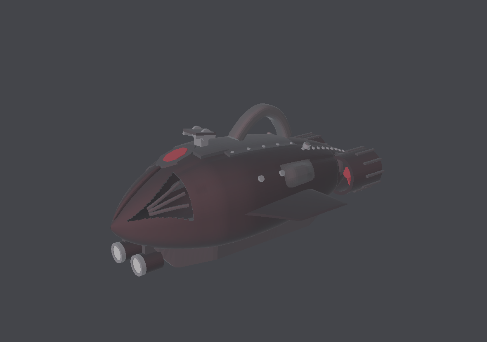
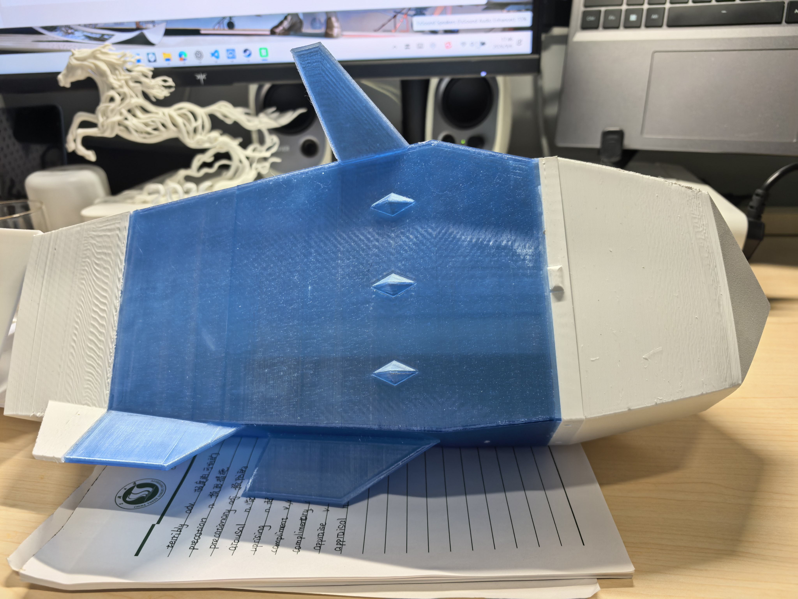
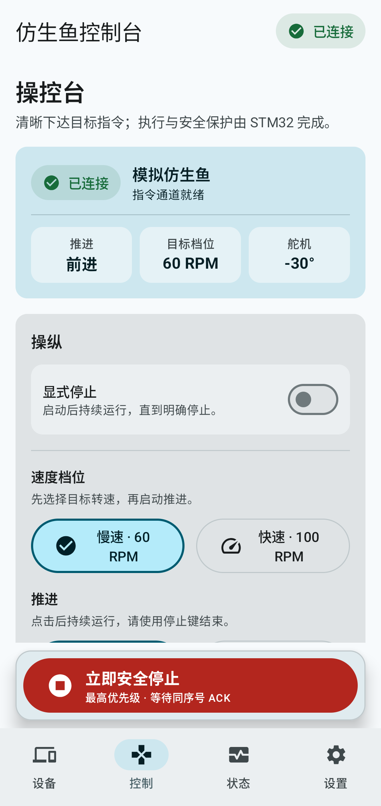

# 仿生鱼工程 · BionicFish

> 一只可在水下自主游动的仿生潜航器 —— 由**一人独立完成**从机械结构设计、电控硬件、嵌入式固件到 Android 上位机的全栈工程实现。外形参考「追鲨一号」构型，结构自主设计。面向课程设计、教学演示与水下任务原型验证。

<p align="center">
  
  
</p>

**开源地址：** [Chemcrin/bionic-fish](https://github.com/Chemcrin/bionic-fish)

---

## 目录

- [一、项目概述](#一项目概述)
- [二、系统总体架构](#二系统总体架构)
- [三、硬件与电气设计](#三硬件与电气设计)
- [四、外观与结构设计](#四外观与结构设计)
- [五、控制方式与通信系统](#五控制方式与通信系统)
- [六、代码架构](#六代码架构)
- [七、上位机与控制台](#七上位机与控制台)
- [八、仓库结构](#八仓库结构)
- [九、快速开始](#九快速开始)

---

## 一、项目概述

本项目制作一只用于水下任务演示的仿生潜航器。整机以**稳定性与可控性优先**为设计原则，不追求高速。

**这是一个人独立完成的全栈工程** —— 从外形与机械结构设计、电控硬件选型与拓展板搭建、嵌入式固件开发，到 Android 上位机与控制协议定义，全部由作者自主设计、自主实现，未采用现成开源飞控/机器人框架套用。

| 维度 | 指标 |
| --- | --- |
| 外形 | 参考「追鲨一号」潜航器外形，**自主完成整机结构设计**，全长 **700 mm** |
| 壳体 | PETG 3D 打印，壁厚 **3.2 mm**，分段式（头 / 体 / 尾） |
| 推进 | **370 直流减速电机**驱动尾段 |
| 沉浮 | **注射器式浮力调节唧筒**，由 **N20 直流减速电机**（12 V 版）经齿轮螺杆驱动活塞 |
| 转向 | **IP65 舵机**，安全行程 **±15°** |
| 电控 | STM32F103C8T6 主控 + ESP-01S Wi-Fi + TB6612 双 H 桥 |
| 姿态 | JY901S（兼容 JY61P 协议）9 轴 IMU，软件 I²C |
| 显示 | SSD1306 128×64 OLED 单页状态屏 |
| 供电 | 3S 航模锂电池（45C），VM ≈ 12 V |
| 上位机 | Android「仿生鱼控制台」v0.5.0，Wi-Fi TCP AP 直连 |

### 1.1 项目难点与特点

| 特点 | 说明 |
| --- | --- |
| **全栈单人造** | 机械结构、电路、固件、协议、上位机 App、网页控制台六层全部由一人打通。跨层改动需要同时理解机械约束、时序约束与协议兼容性，没有分工兜底。 |
| **机械结构自主设计** | 外壳、尾部曲柄摇杆传动、唧筒沉浮机构、快拆结构与各支撑件均为自研。尾部支撑经 V2→V3R→V4R→**V6/V4F** 多轮迭代收敛；唧筒从零设计出「N20 + 齿轮减速 + 螺杆自锁 + 双微动开关限位」的完整传动链。 |
| **参数化外壳建模** | 用 Python 以型线表驱动生成 700 mm 整机外观（90,068 三角面），改参数即可调整线型，再导出 STL/STEP 供 3D 打印与 CAD 后续加工。 |
| **从零定义通信协议** | 自研 V1 ASCII 协议：换行分帧、序号窗口防重放与乱序、故障位图并存多故障、失联 1 s 安全停机。协议同时被 Android App 与板载网页控制台复用。 |
| **裸机实时固件** | 6,000 行 C，无 RTOS，64 KiB Flash / 20 KiB RAM 内跑通双电机、舵机、IMU、OLED、TCP 服务与网页托管。 |
| **可替换、可观测的硬件设计** | 自研拓展板：32 针母座固定核心板、UART 与电机舵机接口全排针扇出、全模组可拔换；板载 CH340 与 SWD 构成**双通道并行调试**，为 AI Agent 辅助开发提供了可闭环的烧录 + 日志通路。 |
| **板级电气与电源自主设计** | 逻辑轨用 ME6211 LDO（低噪声，护住 IMU），动力轨用 LM2596S DCDC（高效率，带电机）；XT60 与咪头双输入适配，5 A 一次性保险丝兜底短路保护。 |
| **踩穿硬件级陷阱** | 自行定位 100% 占空比导致 TB6612 自举电容无法刷新的隐性故障，并留下编译期门禁防止同类问题静默复发（见第三章 3.4）。 |

**首版定位**：无线遥控 + 半自动控制原型，先验证「能游、能控、能安全停机」，视觉自主与深度闭环留待第二阶段增强。

> ⚠️ 本项目为教学原型，**尚处于台架验证阶段，未完成整机下水验收**。软件测试通过不等于整机可用，下水前请确认已装好机械保护、可立即断电，并已完成台架启停、失联与供电恢复测试。

---

## 二、系统总体架构

```text
┌──────────────────────────────────────────────┐
│         Android 控制台「仿生鱼控制台」          │
│   M1 方向 ／ M2 唧筒 ／ 舵机 ±15° ／ 急停       │
└───────────────────┬──────────────────────────┘
                    │ Wi-Fi：BionicFish-AP
                    │ TCP 192.168.4.1:9000
┌───────────────────▼──────────────────────────┐
│              ESP-01S（ESP8266）               │
│   AT 固件 1.7.4.0 ｜ 纯 SoftAP ｜ TCP Server   │
└───────────────────┬──────────────────────────┘
                    │ UART0 ↔ USART2　115200-8N1　无流控
┌───────────────────▼──────────────────────────┐
│           STM32F103C8T6　SYSCLK 72 MHz        │
│  ┌────────────────────────────────────────┐  │
│  │ TIM2 ── PWM ──► TB6612 ─┬─ A 桥 ─► M1 370 推进 │
│  │                         └─ B 桥 ─► M2 N20 唧筒 │
│  │ TIM3 CH1 ── 50 Hz 脉冲 ──► 舵机 PA6     │  │
│  │ 软件 I²C PB6/PB7 ──► JY901S 姿态         │  │
│  │ 软件 I²C PB8/PB9 ──► SSD1306 状态屏      │  │
│  │ USART3 ──► CH340 ──► 调试/诊断输出      │  │
│  └────────────────────────────────────────┘  │
│  ▲ 32 针母座固定 ── UART/电机/舵机全排针扇出   │
└──────────────────────────────────────────────┘
        ▲ SWD                              ▲ USART3
   ┌────┴─────┐                      ┌─────┴──────┐
   │ ST-Link  │                      │ CH340(Type-C)│
   └────┬─────┘                      └─────┬──────┘
        └────────► 同一台主机 ◄────────────┘
              烧录 + 串口日志 双接并行调试
```

**电源链路**：

```text
XT60 / 咪头 ──► 5 A 一次性保险丝 ──► LM2596S (DCDC, 可调)
                                        │
                              ┌─────────┴──────────┐
                              ▼                    ▼
                        动力轨：TB6612 VM、舵机   5 V 中间轨
                                                   │
                                                   ▼
                                        ME6211 (LDO) ─► 3.3 V 逻辑轨
                                        MCU / ESP / IMU / OLED / CH340
```

**两条执行链路分工**：

- **M1（370）→ 尾段推进**：决定「往哪游」，通过尾段摆动产生前进推力与航向；
- **M2（N20）→ 唧筒活塞**：决定「在哪个深度」，通过注射器式容积变化改变排水量，从而调节浮力实现上浮/下潜。

这两路共用一个 TB6612 的两个 H 桥，因此**共用同一 PWM 挡位**，但方向各自独立 —— 推进与沉浮可以同时动作。

**信息流是双向的**：命令从 Android 经 ESP 下达到 STM32；状态帧（`STA`）从 STM32 周期回传，经 ESP 与 CH340N 双路输出，让手机端与串口调试端能同时观察整机状态。

---

## 三、硬件与电气设计

### 3.1 选型对比与决策依据

> 📐 **总体设计思路沿用 TI 杯电子设计竞赛的工程范式**：主控 + 功能模组的积木式组合，每个模组独立供电、独立接口、可单独替换与单独测试，全链路信号都留可测量的测试点。这一取向直接决定了下面几乎每一行的取舍 —— 宁可多花几块钱买成熟模组，也不把风险藏进自绘 PCB 里。

| 环节 | 候选方案 | 最终选择 | 适宜性 | 经济性 | 稳定性 |
| --- | --- | --- | --- | --- | --- |
| **主控** | STM32F103ZET6 / **C8T6** / ESP32 单主控 | **STM32F103C8T6** | 需 5 路 PWM + 2 路 UART + 2 路软 I²C，C8T6 的 37 个 GPIO、16 路定时器通道完全覆盖且有余量；硬件 FPU 与算力对本任务无刚需 | LQFP48 最小系统板约 ¥10–15，远低于 ZET6；生态成熟、资料丰富 | 工业级 Cortex-M3，HAL 库稳定；无操作系统裸机调度，无 RTOS 任务抖动风险 |
| **板级架构** | 自绘一体式 PCB / **核心板 + 拓展板** | **核心板 + 自研拓展板** | 拓展板只做引脚扇出与电源分配，不做信号处理，故障定位边界清晰；核心板可单独取下用 ST-Link 烧录与替换 | 拓展板单次打样即可，改版只需重画扇出层，不牵动主控电路 | 任一功能模组异常时可直接拔换排查，不必怀疑板上焊接；核心板损坏只需换最小系统板 |
| **调试 / 烧录** | 仅 SWD / 仅串口 / **SWD + 板载串口双通道** | **ST-Link SWD + 板载 CH340 Type-C 双接** | 两种通道各司其职：SWD 负责烧录与断点，CH340 负责运行期日志与协议观测 | CH340 芯片约 ¥2，省掉一个外置 USB-TTL 模块与接线工序 | 双通道互为备份；SWD 被占或接触不良时，串口仍能观察到状态帧 |
| **无线通信** | 自绘 ESP8266 透明桥 / ESP32 WebSocket / **ESP-01S AT** | **ESP-01S + AT 固件** | 只需 TCP 透传，AT 模式无需自维护固件；UART 一条线接入即可 | 模组约 ¥8，无需额外 PCB 打样与烧录工装 | 官方 AT 固件经长期验证；每次 AT 事务带响应确认，链路状态可观测 |
| **电机驱动** | L298N / **TB6612FNG** / 分立 MOS H 桥 | **TB6612FNG** | 单芯片双 H 桥，正好驱动 M1 推进与 M2 唧筒两路，PWM 频率范围宽 | 模块约 ¥6，比 L298N 便宜且体积小一半 | 导通电阻低、发热小、自带热关断；无需自绘 H 桥即可获得可靠驱动 |
| **推进方式** | 42 两相双极步进 / **直流减速电机** | **370 直流减速电机** | 直流电机直接调压调速，无需换相表、相序配对与步距角标定，工程复杂度大幅下降 | 370 减速电机约 ¥15，无需专用步进驱动器 | 两根线接入，接反只会反转，不会像步进那样抖动/堵转；无失步风险 |
| **沉浮方式** | 中性浮力 + 鳍面控制 / 可移动配重 / **注射器式唧筒** / 微型水泵 | **注射器式浮力调节唧筒**（N20 驱动） | 通过活塞改变排水体积主动调节浮力，可**原地定深**，不依赖前进速度；相比水泵方案无管路与水泵密封难题 | 100 ml 注射器 + N20 减速电机 + 齿轮螺杆，成本远低于水泵浮力舱 | 机械容积式调节，状态可复现；配双微动开关做行程限位 |
| **姿态传感器** | MPU6050 / **JY 系列** | **JY901S**（兼容 JY61P） | 模块内部完成姿态解算，直接读角度寄存器，主控零算力开销 | 约 ¥50，省去自写互补滤波/Kalman 的开发成本 | 内部温补与磁力计融合，Yaw 为绝对航向而非陀螺积分漂移 |
| **舵机** | 普通舵机 / **IP65 防水舵机** | **IP65 防水舵机** | 水下环境刚需 | 略贵但省去额外防水结构 | 工厂封装防水，可靠性远高于自制密封 |
| **显示** | 无 / **SSD1306 OLED** | **SSD1306 128×64** | 自写单页状态屏即可，不引入图形库 | 约 ¥8 | 免背光、低功耗、I²C 两根线接入 |
| **降压（逻辑轨）** | AMS1117 / **ME6211** / 7803 | **ME6211（3.3 V LDO）** | 压差仅约 100 mV 级，可直接从 5 V 或单节锂电落到 3.3 V，静态电流低 | 单价约 ¥0.5，比 AMS1117 更便宜 | LDO 无开关噪声，适合给 IMU 与 MCU 供电；外围仅需两颗电容 |
| **降压（动力轨）** | 7805 线性 / **LM2596S** | **LM2596S（DCDC）** | 2 A 级输出、可调，覆盖舵机与 12 V 电机轨；开关式效率远高于线性 | 模块约 ¥3，是同级 DCDC 里最便宜的量产件 | 内置限流与热关断；成熟度高，datasheet 与参考设计极为充分 |
| **电源输入** | DC 圆孔 / JST / **XT60 + 咪头双适配** | **XT60 主接口 + 咪头备用** | 主电池走 XT60 保证大电流接触；咪头作为细线备用输入，便于台架接稳压源 | 两个接口合计约 ¥2 | XT60 接触电阻低、极性防呆、可反复插拔；双接口任一路径断线仍可供电 |
| **保护** | 无 / 自恢复保险丝 / **一次性保险丝** | **5 A 一次性保险丝** | 整机峰值电流按 2 A 级设计，5 A 留约 2.5 倍余量，足够抗电机堵转启动冲击 | 单价可忽略 | 熔断特性确定性高于自恢复件，短路时彻底切断，不会反复通断拉弧 |

### 3.2 关键决策：为什么放弃步进电机

早期方案采用「**42 两相双极步进电机 + 软件四拍换相**」驱动尾段，实现中发现三个问题：

1. **换相复杂**：需要维护换相表、相序配对、步距角与减速比标定，且两个桥必须分别驱动两组线圈；
2. **失步不可观测**：无编码器时，步进电机的开环特性无法判断是否丢步，而本体又受水流扰动；
3. **驱动余量不足**：TB6612 单通道 1.2 A 为绝对最大额定值，3.2 A 仅 10 ms 单脉冲条件，驱动步进线圈的余量偏紧。

最终 TB6612 的两个 H 桥改为各驱动一台**有刷直流减速电机**：

- **M1（370）→ 尾段推进**：主推力来源，决定游动方向；
- **M2（N20）→ 唧筒活塞**：驱动注射器活塞推拉，改变排水量实现沉浮。

直流电机不需要换相节拍，启停与换向只由 `IN1/IN2` 两个 GPIO 决定，代码与调试路径都显著简化。

> 📌 `42HS34-FS.STEP` 等步进相关模型属于**已作废方案**，与尾段推进的现状无关，请勿据此推断额定参数。这些遗留件不随仓库发布。

### 3.3 引脚分配

| 功能 | 信号 | STM32F103C8T6 引脚 | 配置与边界 |
| --- | --- | --- | --- |
| MCU / 时钟 | — | — | 64 KiB Flash、20 KiB RAM；HSE 8 MHz × PLL9 = **SYSCLK 72 MHz** |
| M1 PWM（370 推进） | `PWMA` | **PA0** | TIM2_CH1，接 TB6612 A 桥，占空比随挡位取 95% / 60% |
| M2 PWM（N20 唧筒） | `PWMB` | **PA1** | TIM2_CH2，接 TB6612 B 桥，两路共用同一挡位 |
| M1 方向 | `AIN1/AIN2` | **PB12 / PB13** | 推挽 GPIO，决定 A 桥电流方向与 coast |
| M2 方向 | `BIN1/BIN2` | **PB14 / PB15** | 推挽 GPIO，决定 B 桥电流方向与 coast |
| 唧筒限位 | 微动开关 ×2 | 待接 | 活塞行程两端限位，防止螺杆顶死堵转（机械件已建模） |
| STBY | `STBY` | PB5（可选） | **当前默认不占用**，实物 STBY 恒接 3.3 V 高电平 |
| 舵机 | `SIG` | **PA6** | TIM3_CH1，50 Hz、1000–2000 µs，中位 1500 µs |
| ESP 通信 | `USART2` | **PA2 / PA3** | PA2→ESP RXD，ESP TXD→PA3；115200-8N1，无 RTS/CTS |
| 调试输出 | `USART3` | **PB10 / PB11** | 接 CH340N；仅输出诊断与状态帧，不接收控制命令 |
| 姿态 IMU | `SCL / SDA` | **PB6 / PB7** | 独立 GPIO 开漏软件 I²C，**需外接 4.7 kΩ 上拉到 3.3 V** |
| OLED | `SCL / SDA` | **PB8 / PB9** | 独立 GPIO 开漏软件 I²C，模块自带板载上拉 |
| 调试按键 | `K1/K2/K3` | **PB0 / PB1 / PA8** | 低电平有效、内部上拉；⚠️ 下水前须关闭 |
| 运行指示 | — | **PC13** | GPIO 输出，正常每 500 ms 翻转 |
| 烧录 | `SWDIO/SWCLK` | **PA13 / PA14** | 保留调试，禁止改作业务 GPIO |

> 两条软件 I²C 总线**互相独立**：`I2CSCAN` 报 OLED 总线（PB8/PB9）、`IMUSCAN` 报 IMU 总线（PB6/PB7），互不代表对方的结论。

### 3.4 一个典型的硬件陷阱：为什么满速挡是 95% 而不是 100%

台架调试时出现「**VM = 12 V、STBY 已拉高，电机却带不动负载**」。定位过程：

- 100% 占空比在 STM32F1 上落成 `CCR = ARR + 1`，比较输出**恒为高电平、永不翻转**；
- TB6612 的 PWM 输入依赖**持续的开关边沿**维持高侧栅极/自举驱动，恒定高电平会让自举电容无法刷新；
- 结果：高侧开关无法持续导通 → 电机只有微弱/断续驱动能力。

**修正**：占空比降到 **95%**，保证每个载波周期都有一次完整低电平沿；同时把 TIM2 载波周期由 20 kHz 改为 **2 s**（0.5 Hz），让一个周期内的高电平成为「一整段连续导通」，电机看到近似直流而非斩波。

代价与收益：95% × 12 V = **11.4 V**，转速与扭矩相对满压几乎无损；2 s 慢周期下「>0 且 <100」的占空比会产生明显脉动，因此若不需要调速应优先用满速挡。

> 📌 这个坑不在任何数据手册的显著位置，却直接决定整机能否推动负载。记录在此供复刻者避坑。

---

### 3.5 拓展板：把「可替换」做进电路里

硬件全部集成在一块自研拓展板上，核心板通过母座插在板上。整块板的设计目标只有一句话：**任何一路模块出问题，都应该是拔下来换掉，而不是拿烙铁上去查。**

#### 3.5.1 连接器与接口

| 设计点 | 做法 | 解决什么问题 |
| --- | --- | --- |
| **32 引脚母座** | STM32 核心板以直插母座固定，不使用焊死方案 | 主控可整体拔下单独烧录/替换；换核心板不影响板上任何走线 |
| **排针扇出** | UART 与电机、舵机接口**全部引出排针** | 杜邦线即可外接新模组，无需飞线焊点；台架阶段可临时并联示波器或逻辑分析仪探头 |
| **全模块可拆卸** | TB6612、ESP-01S、JY901S、OLED 均经排针/排母连接 | 逐个替换即可定位故障；测试时可用同型号备件直接交叉换件 |
| **双通道调试** | ST-Link SWD（`PA13/PA14`）+ 板载 CH340（`USART3`） | SWD 负责烧录与断点，CH340 负责运行期日志；两者可**同时连接** |
| **Type-C 直连** | 板载 CH340 引出 Type-C 母座 | 一根普通手机线即可接电脑看串口，不必再找 USB-TTL 转接板 |

#### 3.5.2 板载 CH340 的实战价值：双接 AI Agent 联合调试

这是本项目在调试方式上最有价值的一处设计。把 **SWD 与串口同时接到同一台电脑**，就构成了一个「Agent 可闭环的调试环境」：

```text
┌──────────────┐   SWD（烧录/断点/寄存器）  ┌────────────────┐
│  ST-Link     │◄──────────────────────────►│                │
└──────────────┘                            │  STM32F103C8T6 │
┌──────────────┐   USART3（日志/状态帧）     │  拓展板         │
│  CH340(Type-C)│◄──────────────────────────►│                │
└──────┬───────┘                            └────────────────┘
       │ 两条独立 USB 通道同时挂在同一台主机上
┌──────▼───────────────────────────────────────┐
│  AI Agent（可读串口日志 + 可下载固件 + 可复位）  │
└──────────────────────────────────────────────┘
```

**为什么这对 AI Agent 辅助开发是决定性的**：Agent 需要「**改代码 → 烧录 → 看现象 → 再改**」形成一个可自动执行的闭环。

- **能烧**：SWD 通道让 Agent 可以直接下载固件、复位、halt 查看寄存器，不必人工点 IDE；
- **能看**：CH340 通道把 `ESP server=… tcp=… reset=… error=…`、`IMU scl= sda= st= probe=`、`STA` 状态帧全部以**纯文本**形式吐到串口，Agent 无需摄像头或人工转述就能读到设备的真实状态；
- **可交叉验证**：一旦 SWD 侧异常（如烧录报错、连接不上），串口侧仍在独立输出，能立刻区分「是固件没跑起来」还是「是调试器/接线的问题」。

CH340 与 SWD 使用**完全独立的物理通道**，互不抢占资源，因此可以长期保持双接状态。协议本身也为此做了配合：选用**可打印 ASCII + 换行分帧**（见第五章），就是为了让串口日志能被工具与 Agent 直接解析，而不是面对一串需要额外解码的二进制。

> 📌 这里有一个真实踩过的坑：早期调试曾出现 `failed to erase memory`，正是先靠**串口侧日志与 RAM 读写对照实验**排除了 MCU 内部 flash 控制器故障，才没有误判为固件问题（见 [9.4 节](#94-常见故障排查)）。

---

### 3.6 电源架构

#### 3.6.1 双 LDO / DCDC 分工

电源设计上刻意做了**逻辑轨与动力轨分离**，避免电机启停的电流冲击与开关噪声污染 MCU 与 IMU：

| 轨道 | 器件 | 输入 → 输出 | 供给对象 | 选型理由 |
| --- | --- | --- | --- | --- |
| **3.3 V 逻辑轨** | **ME6211**（LDO） | 5 V 中间轨 → 3.3 V | STM32、ESP-01S、JY901S、OLED、CH340 逻辑 | 压差小、静态电流低、**无开关噪声**，姿态传感器对电源纹波敏感，LDO 是更稳的选择；成本约 ¥0.5 |
| **动力轨** | **LM2596S**（DCDC） | 电池 → 电机/舵机电压 | TB6612 的 VM、舵机 | 开关式效率高、可调、2 A 级输出，带电机这类非线性负载时发热远小于线性方案 |

分工的核心考虑是**噪声敏感度**：LDO 效率低但干净，适合 mA 级、怕纹波的逻辑器件；DCDC 有开关纹波但效率高，适合 A 级、不在乎纹波的动力器件。两者各管一段，不在同一条轨上妥协。

> 📌 DCDC 的可调输出先落到 **5 V 中间轨**，再由 ME6211 降到 3.3 V。这样做的原因有二：其一，部分模组（舵机、CH340）需要 5 V 而非 3.3 V；其二，**两级降压的单级压差都更小、发热更可控**，比直接从电池一次跳到 3.3 V 更稳。

#### 3.6.2 输入接口与保护

```text
        ┌──────────────┐
   XT60 ┤              │
        │  5 A 一次性   ├──► LM2596S ─┬─► 动力轨（电机 / 舵机）
  咪头  ┤   保险丝      │            │
        │              │            └─► 5 V 中间轨 ─► ME6211 ─► 3.3 V 逻辑轨
        └──────────────┘
```

| 项 | 设计 | 说明 |
| --- | --- | --- |
| **主电源接口** | **XT60** | 大电流下接触电阻低、有极性防呆、可反复插拔，是航模电池的标准接口 |
| **备用输入** | **咪头接口** | 与 XT60 双适配；台架调试时可接实验室稳压电源，不必拆电池 |
| **过流保护** | **5 A 一次性保险丝** | 整机峰值按 2 A 级设计，5 A 留约 2.5 倍余量以容忍电机堵转启动的瞬时冲击；选一次性而非自恢复型，是为了短路时**彻底切断**，避免自恢复件反复通断造成拉弧与二次损伤 |

> ⚠️ 保险丝**只保护短路与严重过流，不保护接反**。上电前务必确认 XT60 极性；电池正负极接反会直接击穿稳压模块与所有模组。
>
> 📌 上述电源架构以**当前实装版本**为准。早期阶段 B 设计文档中曾规划过更复杂的多轨电源树（含升压轨与 PCA9685 舵机轨），属于历史方案，与本机现状不一致。

---

## 四、外观与结构设计

> **设计归属说明**：本章结构设计**完全由作者自主完成**。外观上**参考了「追鲨一号」潜航器这一公开外形作为风格参考** —— 即借鉴其整体构型语汇（盾形前脸、三角侧翼、圆筒尾部护罩、顶部把手等）作为设计起点，**并非照搬或复刻其模型**；所有尺寸、型线、分件与内部结构均为自主设计与权衡的结果。
>
> Python 参数化脚本在此仅作**辅助工具**：用于快速试算线型、批量生成预览渲染与导出打印用网格，方便迭代。**真正的结构设计（分件方式、装配接口、壁厚与打印方向、内部承载与密封）以 SolidWorks 手工建模与人工判断为准**，脚本不能替代设计决策。

### 4.1 外壳外观设计

外壳以「追鲨一号」**外形风格为参考**自研设计，兼顾水动力外形与 3D 打印可行性。设计要点：

| 部位 | 设计 |
| --- | --- |
| **上壳** | 连续凸面 + 纵向分割缝 + 螺钉列，顶部中央设备/电池舱盖 |
| **下壳** | 浅凹底板 + 纵向导流槽（型线指数取 3.5–3.7 得到「平面或浅凹」效果） |
| **侧翼** | 三角形，前缘直、后缘收拢、略下倾，下反 18 mm |
| **前脸** | 盾牌轮廓 + 中央竖脊；左右三角格栅 + 内部肋条（**真实通孔**） |
| **双灯** | 前下方并列双圆灯 ⌀44 mm，机腹前缘下方短支架安装 |
| **尾部** | 圆弧收尾 + 左右推进器护罩 ⌀98 mm + 中央轴向护罩 ⌀92 mm |
| **把手** | 顶部拱形枪柄式把手，拱高约 60 mm（弧顶即整机最高点） |
| **滑橇** | 底部纵向加强梁，前端接灯支架 |

**进水设计**：前脸左右格栅、腹部 4 条进水槽、尾部推进器开口均为**真实通孔**，且沿孔边生成 3.2 mm 壁厚翻边 —— 不是贴图或凹槽。

<p align="center">
  
  
</p>
<p align="center"><em>外壳外观设计：侧视渲染与六视图预览</em></p>

### 4.2 关键尺寸

| 项 | 数值 | 说明 |
| --- | --- | --- |
| 总长 X | **700.0 mm** | x = 0 为鼻尖 |
| 壳体壁厚 | **3.2 mm** | 建议区间 2.5–4 的中值 |
| 三角面数 | 90,068 | 完整外观网格 |

坐标系：`+X` 纵轴向后，`+Y` 右舷，`+Z` 向上（z = 0 为滑橇触地面），单位 **mm**。

> ℹ️ 上述外观网格由辅助脚本按人工给定的型线表生成，型线比例经目测推定而非实测图纸；横向尺寸未单独标定，制造前需按实物重新测量。

### 4.3 设计流程与可调参数

**设计主线**：作者先在 SolidWorks 中确立分件方案与关键结构，再借助 Python 脚本把定义好的型线快速展开成完整网格，用于预览渲染与打印试制；需要修改外形时改脚本参数即可快速试算，最终结构仍以 CAD 模型为准。

辅助脚本的核心参数集中在 `model.py` 顶部：

```python
L_TARGET = 700.0     # 总长，最后等比缩放到该值
THICK    = 3.2       # 壳体壁厚
NX, K    = 232, 34   # 纵向站数 / 每象限截面点数

#      鼻尖 x=0 .......................................... 尾尖 x=712
XS   = [0,   14,  35,  70,  105, 154, 210, 280, 350, 420, 490, 560, 616, 658, 700, 708, 712]
WID  = [1.5, 18,  40,  66,  86,  108, 126, 134, 131, 123, 112, 98,  82,  66,  44,  28,  2.0]  # 半宽
ZTOP = [118, 134, 155, 182, 203, 224, 238, 240, 236, 229, 218, 202, 184, 166, 146, 139, 134]  # 上缘
ZWL  = [114, 112, 112, 114, 117, 120, 123, 125, 125, 125, 125, 126, 128, 131, 134, 135, 133]  # 最宽线
ZBOT = [110, 92,  76,  60,  50,  41,  35,  34,  34,  36,  40,  50,  66,  90,  120, 128, 131]  # 下缘
NUP  = [...]         # 上半截面超椭圆指数，越大越"方"
NLO  = [...]         # 下半截面指数
```

改完参数直接重建：

```bash
python modeling/build.py          # 加 --no-render 可跳过预览渲染（渲染约 20 s）
```

**生成产物**：完整外观网格（STL/OBJ/MTL）、头/体/尾分段 STEP（0–180 / 180–520 / 520–710 mm）、面片化 STEP 参考装配、六视图预览。这些产物用于**预览与打印试制**，制造级结构仍需在 SolidWorks 中完成（见 4.6）。

### 4.4 沉浮机构：「唧筒」浮力调节

沉浮采用**注射器式浮力调节**方案，是整机仅次于推进机构的第二套关键机械系统。核心思路：通过改变鱼体排水体积主动调节浮力，从而**不依赖前进速度即可原地定深**。

```text
N20 直流减速电机
    │
    └─► 马达齿轮 ──► 大齿轮（减速）──► 螺杆 ──► 活塞
                                          │
                            100 ml 注射器筒体 ──► 排水体积变化
                                          │
                          微动开关 ×2 ◄────┴──── 行程两端限位
```

| 零件 | 作用 |
| --- | --- |
| N20 电机模型 | 动力源，12 V 直流减速电机 |
| 马达齿轮 / 大齿轮 | 减速增扭，把电机转速降到活塞可用的推拉速度 |
| 螺杆 / 自锁六角螺母 | 将旋转运动转为直线运动；螺纹自锁保证断电后活塞不回退 |
| 活塞 / 100 ml 活塞底座 | 推拉改变注射器内容积 |
| 唧筒 / 唧筒盖 / 唧筒顶 / 唧筒注射器 | 筒体与密封结构 |
| 微动开关 ×2 / 限位触发轴 | 活塞行程两端限位，防止螺杆顶死导致堵转 |

**为什么选这条路**：早期计划书里比较过四种沉浮方案，最终选择唧筒式而非「中性浮力 + 鳍面控制」，原因是后者需要持续前进才能产生升沉力，**低速或原地无法定深**；而水泵方案虽然也能主动调节，但管路与水泵的密封复杂度高得多。唧筒式是机械容积调节，状态可复现，且**螺纹自锁天然提供断电保位**。

> 📌 唧筒的**限位开关接线尚未纳入当前固件**，活塞行程保护需在实机联调时补充。

### 4.5 结构件自主设计与迭代

除外壳与唧筒外，尾部装配是机械设计的核心，也是自主设计中投入迭代最多的部分。相关件均从零绘制，经多轮修改收敛：

| 零件 | 最终版本 | 说明 |
| --- | --- | --- |
| 尾部支撑 | **左支撑 V6F / 右支撑 V4F** | 自研件，经 V2 / V3R / V4R 多轮迭代收敛，是尾段承载与传动的基准 |
| 传动 | 套筒、摇杆、`moto shef`（电机座）、U 型件 | 曲柄摇杆式尾段传动，零件均为自主建模 |
| 关节 | 鱼体第二关节 | 分段装配接口，兼顾装配精度与打印分件 |
| 快拆 | 快拆架、防水盒快拆 | 便于检修与电池更换 |

**迭代过程的取舍**：尾部支撑从 V2 到 V6F/V4F 的演进中，反复调整了传动力臂、支撑刚度与打印方向之间的平衡 —— 早期版本偏重外形贴合，后期版本为保证电机负载下的结构刚性而增加了加强筋与壁厚。这类权衡是纯脚本无法代劳的设计决策。

> 📦 **可发布的尾段零件已整理至仓库根目录 [`鱼尾装配/`](鱼尾装配/README.md)**，含上述最终版零件、装配体与一份零件清单说明，复刻者可直接取用。
>
> 📌 早期版本（V0.2 / V3R / V4R / draft）与完整建模工作区已归档至本地 `建模/`，**不随仓库发布**，避免复刻者误用过期尺寸。已废弃的步进方案件（`42HS34-FS.STEP`、`步进支架.step`）同样不发布。

### 4.6 已知结构局限

- 开口边缘沿网格四边形量化，放大看有轻微台阶；制造级模型需在 CAD 中用裁剪曲面重建开口。
- 内部电气（电池盒、控制器）未建模 —— 原型说明明确了「不必照搬内部电气尺寸」。
- 辅助脚本产出的网格为多部件叠加，**非单一水密实体**；直接 3D 打印前需先在 CAD / 切片软件中做布尔合并。
- 制造级工作（止口、密封槽、螺钉孔、装配间隙）需在 SolidWorks 中完成，脚本产物定位为外观与装配参考，不作为最终加工依据。
- STEP 采用每个源三角面对应一个平面面的 **faceted B-REP**，非参数化 NURBS，不保证导入后自动成为水密实体。
- 唧筒活塞在注射器筒体内的**动密封**是全机防水的关键风险点，需实测确认。

---

## 五、控制方式与通信系统

### 5.1 通信链路

```text
Android ── Wi-Fi (BionicFish-AP) ──► ESP-01S ── UART0/USART2 ──► STM32
                                                                   │
Android ◄── Wi-Fi ◄── ESP-01S ◄── USART2 ────────────────────────┤
                                                                   │
                                         CH340N ◄── USART3 ◄───────┘
```

| 参数 | 值 |
| --- | --- |
| SSID / 密码 | `BionicFish-AP` / `12345678` |
| AP / 网关 | `192.168.4.1` |
| 掩码 | `255.255.255.0` |
| 传输 | TCP Server，端口 `9000` |
| Wi-Fi 模式 | `AT+CWMODE=2`（**纯 SoftAP**） |
| 串口 | 115200 / 8N1 / 无流控 |

> ⚠️ **Wi-Fi 模式必须是 2（纯 AP）**。曾出现 `CWMODE=3`（AP+STA 双模）导致网页完全打不开的回归：固件从不下发 `AT+CWJAP`，STA 侧永远拿不到凭据，ESP 反复去连 flash 里残留的旧 AP，双模下还要同时维护 DHCP 与多个 socket 槽位，最终客户端拿不到 IP。若将来要启用双模，**必须同时实现 `AT+CWJAP` 下发**。

### 5.2 控制协议（V1 ASCII）

采用**可打印 ASCII + 换行分帧**，便于 APK 与串口工具直接调试。不提供加密、鉴权或传输层 CRC。

```text
<TYPE,key=value,key=value,...>\n
```

#### 控制帧：Android → ESP → STM32

```text
<CMD,seq=12,move=F,turn=R,step_speed=60,servo=-15,m2=R>\n
```

| 字段 | 取值 | 含义 |
| --- | --- | --- |
| `seq` | 0–65535 | 16 位序号，用于重复、乱序与丢包检测 |
| `move` | `F`/`R`/`S` | **M1（370）**前进 / 反向 / 停止 |
| `turn` | `L`/`R`/`C` | 左 / 右 / 居中，必须与 `servo` 符号一致 |
| `step_speed` | `60`/`100` | 占空比挡位：100 = 满速挡（95%）、60 = 低速挡（60%） |
| `servo` | −15 ~ +15 | 相对中位角（度），负值左、正值右 |
| `m2` | `F`/`R`/`S` | **M2（N20 唧筒）**活塞推/拉/停，**选填，缺省 = 停止** |

> 📌 `step_speed` 是**历史字段名**。旧步进方案用它选转速档，现改为承载直流电机占空比挡位；字段名与取值范围保持不变以兼容旧客户端。

#### 状态帧：STM32 → ESP / CH340N

```text
<STA,seq=12,link=1,step_rpm=NA,step_est=NA,step_actual=NA,step_on=1,
     servo=-15,roll=1.2,pitch=-2.4,yaw=85.7,m1=F,m2=R,err=0>\n
```

按 `CFG_STATUS_PERIOD_MS`（当前 **200 ms**）周期发送。关键字段语义：

- `link=1` 表示近期收到有效应用命令，**仅代表应用控制链路新鲜，不证明 Wi-Fi 或安卓真实在线**；
- `step_rpm` / `step_est` / `step_actual` 固定为 `NA` —— 本硬件**无编码器**，不做转速反馈；
- `step_on` 恒等于 `(m1 != S)`，表示驱动命令状态，**不证明机械轴实际转动**；
- `roll/pitch/yaw` 读不到或过期时为 `NA`，**不能把 0.0 当作有效测量**。

#### 应答与错误

```text
<ACK,seq=12,result=OK>\n        # 新命令执行成功
<ACK,seq=12,result=DUP>\n       # 幂等重传
<ERR,seq=12,code=E_RANGE>\n     # 参数越界
<ERR,seq=NA,code=E_FORMAT>\n    # 帧格式错误
```

错误码覆盖格式（`E_FORMAT`）、超时（`E_FRAME_TIMEOUT`）、超长（`E_TOO_LONG`）、字段（`E_FIELD`/`E_DUP_FIELD`/`E_MISSING_FIELD`）、越界（`E_RANGE`）、语义（`E_SEMANTIC`）、序号（`E_SEQ_CONFLICT`/`E_SEQ_OLD`/`E_SEQ_AMBIGUOUS`）等类别。

#### 故障位图 `STA.err`

多个故障可同时置位并相加，例如 `err=5` = 链路超时（1）+ IMU 数据超时（4）。

| 位 | 值 | 名称 | 含义 |
| ---: | ---: | --- | --- |
| 0 | 1 | `FAULT_LINK_TIMEOUT` | 有效控制帧超时或接收溢出后的强制断链 |
| 1 | 2 | `FAULT_ESP_RX_LOST` | ESP/USART2 接收缓冲溢出或 ORE 丢字节 |
| 2 | 4 | `FAULT_IMU_DATA_TIMEOUT` | 姿态数据过期/不可用 |
| 3 | 8 | `FAULT_IMU_I2C_RECOVERY_FAILED` | 姿态软件 I²C 总线恢复失败 |
| 4 | 16 | `FAULT_STEPPER_DISABLED` | 配置显式禁用该路电机输出（错误码名沿用旧方案） |
| 5 | 32 | `FAULT_UART_TX_DROPPED` | UART 发送队列丢弃 |
| 7 | 128 | `FAULT_OLED_I2C` | OLED 软件 I²C 运行期异常 |
| 8 | 256 | `FAULT_CONFIGURATION` | 关键配置或定时器初始化不一致 |

> 注意：协议错误用即时 `ERR` 告知；`STA.err` **只描述持续活动的运行期故障**，二者不可混用。

### 5.3 失联与溢出安全策略

**超过 1000 ms 未收到有效命令**时，固件立即：

1. 两路电机全部停止，A/B 两桥**同时进入 coast**（无励磁停止，不保持未知电流）；
2. 舵机按配置回中（默认回中，避免机械卡滞）；
3. `link=0`、置 `BF_FAULT_LINK_TIMEOUT`，主动关闭旧 TCP 连接释放单客户端槽位。

**接收缓冲溢出 / UART ORE** 触发更严格的策略：立即丢弃残余字节、重置解析器、清除会话与序号窗口、停止两路电机、回中舵机 —— **不等待普通的 1 秒保活超时**。

> 💡 安全设计原则：**任何解析、语义或序号失败都不能造成部分电机或舵机动作**。非法帧、语义拒绝帧和旧帧都不能刷新保活。

### 5.4 序号窗口机制

序号窗口是防「命令重复执行」和「乱序覆盖」的核心机制：

| 条件 | 动作 |
| --- | --- |
| 首帧 / 失联后新建会话 | 接受，建立窗口 |
| 序号相同且控制字段完全相同 | 视为**幂等重传**，不重复执行，回 `ACK,DUP` 并刷新保活 |
| 序号相同但载荷不同 | 拒绝，`E_SEQ_CONFLICT` |
| 模 65536 差值 1–32767 | 接受（差值 >1 记录序号缺口） |
| 差值 = 32768 | 回绕歧义，拒绝，`E_SEQ_AMBIGUOUS` |
| 差值 > 32768 | 旧帧/乱序帧，拒绝，`E_SEQ_OLD` |

### 5.5 舵机方向约定

固件在与上位机对接的那一层把角度取反（`angle = -angle`），因此**网页/协议侧只需按「左 = 正、右 = 负」的直觉下发**，最终脉宽方向由固件统一保证。

> ⚠️ **极性反转只允许存在于一层**。本轮修正时发现网页端与固件端各反了一次、相互抵消成「网页左键实际右转」，已把网页端映射改回与固件一致。

安全行程 `±15°` 的换算基准仍是 `CFG_SERVO_FULL_SCALE_DEG = 30`，因此 ±15° 只给出满量程 **1/2** 的脉宽偏移：左 −15° → 1750 µs、右 +15° → 1250 µs、0° → 1500 µs，**不再出现 1000/2000 µs 端点**。

---

## 六、代码架构

### 6.1 分层设计

固件约 **6,000 行 C 代码**，按职责严格分层，`main.c` 只做初始化与主循环调度，业务逻辑不堆放在入口文件。

```text
STM32控制工程/
├── Core/            CubeMX 生成层（时钟、GPIO、TIM、USART 初始化）
│   ├── Inc/  Src/     main.c 仅初始化 + while(1){ App_Process(); }
├── app/          应用层：状态机与调度
│   ├── app.c         主循环调度、命令分发、超时检查
│   └── app_config.h  ★ 全部可调参数的唯一入口
├── bsp/          板级支持层
│   ├── bsp_board.c   板级初始化、紧急 coast
│   ├── bsp_time.c    32 位微秒时基（TIM4 扩展）
│   ├── bsp_uart.c    环形缓冲收发、错误回调
│   └── esp_link.c    ★ ESP-01S AT 状态机
├── control/      控制层
│   ├── motor_control.c  两路 H 桥 IN1/IN2 与占空比
│   ├── servo_control.c  舵机角度→脉宽换算与限幅
│   ├── control_arbiter.c 本地调试按键与远端命令的仲裁
│   └── faults.h         故障位定义
├── drivers/      驱动层
│   ├── soft_i2c.c    软件 I²C（两条独立总线复用）
│   ├── ssd1306.c     OLED 驱动
│   └── jy61p.c       IMU 角度寄存器读取
├── ui/           界面层
│   └── oled_ui.c     单页 ASCII 状态屏
├── protocol/     协议层
│   ├── ascii_protocol.c  V1 ASCII 组帧/解析/校验
│   ├── http_ui.c         内嵌网页控制页（447 行）
│   └── ring_buffer.c     无锁环形缓冲
├── cmake/        工具链与链接脚本
├── scripts/      构建、烧录、串口工具
└── tests/        主机回归测试
```

### 6.2 设计原则

下面五条是本固件在实现中反复兑现的约束，也是代码评审时的检查项。

**① 中断只做搬运，主循环做决策**
UART 中断仅把字节写入固定大小环形缓冲，完整帧解析在主循环完成。中断里不做任何阻塞业务，也不直接驱动执行器。

**② 固定内存，无动态分配**
所有缓冲、字段表、状态槽均为固定大小数组，业务代码不使用 `malloc`。这既保证 RAM 占用可预测（当前 79.92%），也避免碎片化导致的长期运行风险。

**③ 配置集中于单一入口**
所有可调参数集中在 `app_config.h`，并配以**编译期静态校验**。例如：

```c
#if ((CFG_HSE_VALUE_HZ * CFG_PLL_MULTIPLIER) != CFG_SYSCLK_HZ)
#error "HSE 与 PLL 倍频必须严格计算出 CFG_SYSCLK_HZ。"
#endif

#if (CFG_MOTOR_LOW_DUTY_PERCENT > CFG_MOTOR_FULL_DUTY_PERCENT)
#error "CFG_MOTOR_LOW_DUTY_PERCENT 必须在 1..CFG_MOTOR_FULL_DUTY_PERCENT。"
#endif
```

定时器折算、占空比边界、舵机行程一致性全部在**构建期**拦截，不让配置错误退化成运行期静默故障。

**④ 用编译期门禁防止回归**
缓冲区不匹配曾导致「网页静默发不出去」：`HTTP_RESPONSE_BYTES` 为 4096，而传输缓冲 `HTTP_RAW_BYTES` 只有 3584，响应超长一个字节都发不出去，且串口上 `error=OK`、`reset=0`、`uloss` 不涨 —— **整个失败过程完全静默**。

修复方式除了对齐两个缓冲，还加了编译期门禁：

```c
/* esp_link.c —— 今后只要有人再让传输缓冲小于响应缓冲，构建直接失败 */
static char kHttpRawMustFitResponse[
    (HTTP_RAW_BYTES >= HTTP_RESPONSE_BYTES) ? 1 : -1];
```

**⑤ 执行器动作原子化**
任何一帧命令的校验失败都**不能造成部分动作** —— 要么两路电机与舵机全部按新目标更新，要么全部保持原状。这条约束通过「先完整校验、后统一提交」的两阶段实现保证。

### 6.3 主循环调度时序

各任务的执行周期由 `app_config.h` 统一约定，主循环按到期与否依次推进：

```text
App_Process() 每次迭代：
  ├─ 协议解析       收到完整帧即处理（非周期）
  ├─ 命令分发       校验通过后统一提交执行器
  ├─ 失联检查       1000 ms 无有效命令 → 双停 + 回中 + 关 TCP
  ├─ 姿态采样       每 50 ms  读 JY901S 角度寄存器
  ├─ 状态帧发送     每 200 ms 组 STA 帧 → USART2 + USART3
  ├─ OLED 刷新      每 200 ms 推进一帧；未初始化时每 2000 ms 重试
  └─ IMU 诊断输出   每 1000 ms 打印总线电平与采样统计
```

优先级从高到低为：**命令应答（ACK/ERR） > 控制执行 > 状态上报 > 界面刷新**。状态帧是低优先级，串口队列拥塞时不应阻塞控制或挤掉 ACK。

### 6.4 关键模块：`esp_link.c` 的 AT 状态机

ESP-01S 的 AT 通信是本工程最脆弱的一环，处理要点：

- **逐命令配置并等待自身响应**：核查版本、串口、AP 地址后才创建服务，**不用 `ATE0` 的 OK 代替 `CIPSERVER` 成功**；
- **发送三阶段**：先等 `CIPSEND` 的 `>` → 再发送声明的**准确字节数** → 最后等 `SEND OK`；
- **事件队列分离优先级**：`ACK/ERR` 走事件 FIFO，周期 `STA` 只保留**一个可替换的最新状态槽** —— 避免状态帧拥塞挤掉控制应答；
- **拒绝额外控制客户端**：收到 `CONNECT` 记录连接 ID，`CLOSED`/ESP 重启/接收丢失/发送失败都会撤销控制会话并进入失联安全态；
- **不盲目发 `AT+RST` 或 `+++`**：不能确认 ESP 是否仍等待数据时，诊断输出 `reset=1` 表示需要实际复位，观察到 `ready` 后重新初始化。

### 6.5 主机回归测试

固件代码可在 **PC 上编译运行**，不依赖实板即可验证逻辑：

```powershell
python scripts/build.py host --bootstrap --host-cc C:/path/to/native-gcc.exe
```

通过 HAL 桩（`tests/*/stubs/`）替换硬件依赖，覆盖协议解析、电机控制、PWM 折算、传感器与 OLED 等模块，另含**编译期门禁测试**（故意传入非法配置，验证构建确实失败）。

---

## 七、上位机与控制台

### 7.1 Android 控制台

采用 **Kotlin + Jetpack Compose + Material 3**，单 Activity + 导航架构，网络、协议、重连与完整控制目标均在 UI 之外管理。

| 页面 | 主内容 |
| --- | --- |
| **设备** | AP 热点直连常驻卡、系统 Wi-Fi 设置入口、LAN/Mock 发现、连接进度与错误 |
| **控制** | 连接状态、M1 推进与 M2 唧筒独立方向组、±15° 舵机、回传状态、固定底栏双路急停 |
| **状态/调试** | 两路固件方向、兼容 RPM（NA）、舵角、姿态、延迟、最后更新、故障与日志导出 |
| **设置** | 独立 AP/LAN 参数、通信时序、两路反向开关、安全停止与减少动态效果 |

<p align="center">
  
</p>

工程结构：

```text
app/src/main/java/com/bionicfish/controller/
├── transport/   TCP、UDP、Wi-Fi 专用 Socket、Mock
├── protocol/    CMD 编码、STA/ACK/ERR、流式分帧
├── device/      会话、握手、发送队列、安全停止、重连
├── control/     ViewModel 与完整控制目标
├── telemetry/   回传状态、新鲜度、故障位、本地日志
├── settings/    DataStore、AP 参数、用户偏好
└── ui/          Compose 页面、主题、导航、可复用组件
```

**构建配置**：Java 17 / Kotlin 2.3.21 / Gradle 8.13 / AGP 8.13.2，min·target·compile SDK = 26·36·36。

**安全设计**：底部「立即安全停止」始终可达，**不加阻碍紧急停止的二次确认**；导航离开、切后台、断开连接均按策略双停，**重连不恢复旧方向**；网络急停失败必须提示，不能把本地目标当成确认停机。

### 7.2 内嵌网页控制页

ESP-01S 除 TCP 控制端口外，还提供 **HTTP 控制页**：手机连上 `BionicFish-AP` 后，浏览器直接访问 `192.168.4.1:9000` 即可操作，无需安装 APK。

页面经过一轮重做，支持「低速挡」运行时切换与舵机限角。

> ⚠️ 网页与 Android 会**争抢同一个控制客户端槽位**。固件只接受一个控制客户端，网页与 App 同时连接时，后到者会被 `AT+CIPCLOSE`。

### 7.3 硬件与电气设计的成本小结

| 类别 | 主要器件 | 量级 |
| --- | --- | --- |
| 主控与通信 | STM32F103C8T6、ESP-01S、CH340N | ¥30 量级 |
| 驱动与执行 | TB6612FNG、370 减速电机、N20、IP65 舵机 | ¥100 量级 |
| 传感与显示 | JY901S、SSD1306 | ¥60 量级 |
| 电源与保护 | ME6211、LM2596S、XT60、咪头座、5 A 保险丝 | ¥20 量级 |
| 接口与结构 | 拓展板打样、排针排母、32 针母座 | ¥50 量级 |
| 结构 | PETG 耗材、紧固件、密封件 | ¥100 量级 |
| 电源 | 3S 航模锂电、稳压模块 | ¥100 量级 |

**设计取向是「用成熟模组换开发时间」**：ESP-01S 用 AT 固件而非自绘透明桥，IMU 用模块内部解算而非自写滤波，舵机用成品防水件而非自制密封，电源用 LM2596S 量产模块而非自绘 DCDC —— 每一处都选择了「贵一点但少一个失败点」的方案。

> 📌 有一点需要特别说明：**电源与接口上的钱花得非常少**。ME6211 单价约 ¥0.5、LM2596S 模块约 ¥3、XT60 与咪头座合计约 ¥2，全部加起来不过一杯奶茶。真正决定这台机器能不能稳定跑起来的，不是这几块钱的器件，而是**把「可替换、可观测、可保护」当成硬约束写进设计里** —— 这一点与预算无关，只与工程纪律有关。

> 📌 上述为按器件与功能类别的量级估算，**不含具体单价与供应商信息**。完整采购清单归档于项目内部资料，不随公开仓库发布。

---

## 八、仓库结构

```text
仿生鱼工程/
├── README.md                    ← 本文件
├── CHANGELOG.md                 开发日志（按版本/日期记录）
├── docs/
│   └── images/                  文档配图
├── 仿生鱼完整项目交付包_v0.5/      ★ 完整交付包
│   └── 仿生鱼完整项目交付包/
│       ├── STM32控制工程/         固件源码、构建脚本、协议与硬件文档
│       ├── 仿生鱼安卓_v0.5.0_交付包/  Android 源码 + APK + 验证报告
│       └── 交付说明.md
├── 电气设计说明/                  ★ 电源架构、拓展板接口与调试通道
├── 鱼尾装配/                     ★ 尾段结构件开源（零件 + 装配体 + 清单）
└── 实物图片/                     结构件照片
```

> 📌 以下目录**不随仓库发布**，已在 `.gitignore` 中忽略，仅保留本地副本：
> `建模/`（完整 SolidWorks 工作区，含外壳辅助脚本、历史版本、第三方素材）、
> `电子信息方案/`（早期方案原始资料，含 `.epro2` 工程文件、导出图片与 AI 提示词草稿）、
> 讲演素材与参考图。整理后的成果已分别发布为 `鱼尾装配/` 与 `电气设计说明/`。

**入口导航**：

| 我想… | 去哪里 |
| --- | --- |
| 了解当前固件与硬件边界 | [`STM32控制工程/README.md`](仿生鱼完整项目交付包_v0.5/仿生鱼完整项目交付包/STM32控制工程/README.md) |
| 编译固件 | [`scripts/BUILDING.md`](仿生鱼完整项目交付包_v0.5/仿生鱼完整项目交付包/STM32控制工程/scripts/BUILDING.md) |
| 看通信协议细节 | [`通信协议.md`](仿生鱼完整项目交付包_v0.5/仿生鱼完整项目交付包/STM32控制工程/通信协议.md) |
| 查引脚与驱动 | [`硬件引脚与驱动说明.md`](仿生鱼完整项目交付包_v0.5/仿生鱼完整项目交付包/STM32控制工程/硬件引脚与驱动说明.md) |
| 查电源架构与电压 | [`电源方案与电压汇总.md`](电气设计说明/电源方案与电压汇总.md) |
| 查拓展板接线与调试通道 | [`拓展板接口与调试通道.md`](电气设计说明/拓展板接口与调试通道.md) |
| 编译/安装 Android 应用 | [`Android工程/README.md`](仿生鱼完整项目交付包_v0.5/仿生鱼完整项目交付包/仿生鱼安卓_v0.5.0_交付包/Android工程/README.md) |
| 取尾段结构件 | [`鱼尾装配/README.md`](鱼尾装配/README.md) |
| 看验收边界 | [`验收检查清单.md`](仿生鱼完整项目交付包_v0.5/仿生鱼完整项目交付包/STM32控制工程/验收检查清单.md) |

---

## 九、快速开始

### 9.1 固件构建

在 `STM32控制工程/` 目录：

```powershell
python scripts/build.py firmware --bootstrap     # 编译固件
python scripts/build.py host --bootstrap --host-cc C:/path/to/native-gcc.exe   # 主机测试
```

产物输出至 `build-firmware/`，包含 `.bin`、`.elf`、`.map` 与记录版本/哈希的 `build-info.json`。当前固定 CubeF1 v1.8.6。

> ⚠️ **不要在源码目录直接用 CubeMX 重新生成**，按构建说明在独立目录生成后审核合并 —— 只核对引脚数值就覆盖受维护的 Core 代码会导致回归。
> ℹ️ 构建**只产生文件，不会自动烧录或驱动电机**。

### 9.2 Android 构建

```powershell
./scripts/Build-Apk.ps1 -JdkHome '你的JDK17目录' -AndroidSdk '你的AndroidSDK目录'
./gradlew.bat connectedDebugAndroidTest --no-daemon --no-parallel
```

产物位于 `app/build/outputs/apk/debug/app-debug.apk`。或直接安装交付包中的 `BionicFish-v0.5.0.apk`。

### 9.3 首次通电流程

1. **接线检查**：确认 ESP-01S 使用受支持的 AT 固件、USART2 交叉收发正确、115200-8-N-1、3.3 V 供电充足；检查两条 I²C 总线（PB6/PB7 **需外接 4.7 kΩ 上拉**）。
2. **上电前检查电源**：确认 XT60 极性与电池正负一致（**保险丝不防接反**）；确认 ME6211 逻辑轨输出为 3.3 V、LM2596S 动力轨输出已调到电机/舵机额定电压；确认 5 A 保险丝已装好、未用导线短接。
3. **双通道接入**：SWD 接 ST-Link（烧录/断点），Type-C 接板载 CH340（串口日志），**两根线可同时插**。上电后先在串口里应能看到周期性的状态输出。
4. **串口观察**：通过 USART3 查看 `ESP server=... tcp=... reset=... error=...`。`server=1` 表示服务初始化完成，`tcp=1` 表示有控制客户端。
5. **连接**：手机加入 `BionicFish-AP`（密码 `12345678`），保持该无互联网 Wi-Fi，在 Android 设备页点击「AP 直连」。
6. **握手**：应用发送完整合法的 STOP CMD，收到同序号 ACK 与 `link=1` 的 STA 后才显示已连接。**加入 Wi-Fi 或连上 TCP 本身不等于握手完成。**
7. **台架验证**：先验证 STOP 的 ACK、STA、舵机与姿态，再点击前进做低速连续转动测试。确认台架启停、失联、ESP 复位、供电恢复后再考虑下水。

### 9.4 常见故障排查

| 现象 | 排查方向 |
| --- | --- |
| 全板无电、串口无任何输出 | 先查 **5 A 一次性保险丝是否已熔断**（熔断为不可逆，需更换）；再查 XT60 是否插到位、电池是否有电 |
| 上电即烧毁模组 | **极大概率是 XT60 极性接反**。保险丝不防反接，务必用万用表确认极性后再上电 |
| 逻辑轨电压不是 3.3 V | 查 ME6211 输入是否正常、输出电容是否虚焊；该 LDO 压差很小，输入低于约 3.5 V 就会跌出稳压区 |
| 动力轨电压不对 / 电机无力 | 调 LM2596S 电位器到电机额定电压；确认其输入未低于最小工作压差，且未触发限流 |
| 电机一转，IMU/OLED 就异常复位 | **逻辑轨与动力轨未隔离干净**。检查两轨是否共用了一段细走线，或地线回流路径过窄 |
| 电机不转但代码/接线无异常 | **优先查 TB6612 的 STBY** —— 只要 STBY 为低，两个 H 桥输出全部高阻 |
| 有 12 V、STBY 已拉高却带不动负载 | 占空比是否为 100%？见 [3.4 节](#34-一个典型的硬件陷阱为什么满速挡是-95-而不是-100) |
| 屏能显示但 IMU 读不到 | 多为 **PB6/PB7 缺外部 4.7 kΩ 上拉**（`IMU … pu=11` 即为该判据） |
| AP 能加入但网页/TCP 打不开 | 查 `CFG_ESP_WIFI_MODE` 是否为 **2**（纯 AP）；查 `server=` 是否为 1 |
| 姿态显示 `R:--- P:--- Y:---` | 看 USART3 的 `I2CBUS` → `IMUSCAN` → `IMU scl= sda= st= probe=` 三段诊断 |
| App 连上就断、反复重连 | `AT+CIPSTO=3`（3 秒无数据即断开）+ 固件只接受单个控制客户端；**已知未修复项** |
| 烧录报 `failed to erase memory` | 先用 RAM 读写对照实验排除 MCU 内部 flash 控制器故障 |

> 💡 **排查顺序建议**：先看**串口有没有输出**（判断 MCU 是否在跑）→ 再看**两轨电压是否正常**（判断供电）→ 最后才怀疑具体模组。因为有双通道调试，绝大多数问题在两分钟内就能定位到「是哪一层」。

---

## 附：开发历程

项目自 2026 年 5 月启动，经历三个阶段：

| 阶段 | 时间 | 主要工作 |
| --- | --- | --- |
| **方案探索** | 5–6 月 | 项目定位、需求拆解、硬件选型、项目计划书迭代至 v3.2 |
| **机械与通信** | 6–8 月 | 曲柄摇杆机构自主设计、外壳外观建模与分件、STM32 拓展板设计、通信协议定义 |
| **电控收敛** | 9 月 | 推进方案由步进改为直流减速电机、TCP 链路修复、双挡位与舵机限角、网页控制页重做、Android v0.5.0 |

完整记录见 [CHANGELOG.md](CHANGELOG.md)。

---

## 致谢

感谢「自然与设计」课程提供的指导与支持。
感谢维特智能（WitMotion）与乐鑫（Espressif）的公开技术文档。

## 许可

本项目为课程设计成果。如需引用、复刻或二次开发，请先联系作者。
