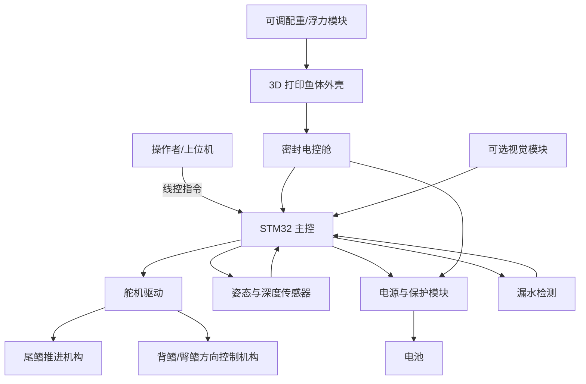

# 仿生鱼项目计划与需求框架

> 来源：根据《仿生鱼要求文档.docx》整理与扩展  
> 版本：v0.1  
> 日期：2026-05-01  
> 目标：把初步想法转化为可讨论、可分工、可测试的项目计划。

## 1. 项目定位

本项目计划制作一只以稳定性和可控性为优先目标的仿生鱼，用于水下任务演示或比赛任务。仿生鱼需要能够在水中稳定游动、可控沉浮，并通过尾鳍、背鳍、臀鳍等翼面配合完成方向控制，最终实现对不同高度、不同位置坐标点的接近与打卡。

首版不追求竞速，优先选择重心较低、平衡性较好的常规鱼型，例如鲫鱼、鲤鱼等构型。整体研发策略是先完成可靠可控的线控版本，再视比赛规则和项目周期决定是否加入视觉识别与自主决策能力。

## 2. 项目目标

### 2.1 核心目标

- 制作一只可以下水运行的仿生鱼实体样机。
- 实现基础推进：尾部摆动驱动鱼体前进。
- 实现方向控制：通过尾鳍、背鳍、臀鳍等翼面调整方向和姿态。
- 实现沉浮控制：能在任务区域内完成上浮、下潜或定深控制。
- 实现任务打卡：能到达位于不同高度和位置的坐标点，并完成触发、接近或识别式打卡。
- 保证水下运行安全：电路、舵机接线、电池和主控区域具备可靠防水措施。

### 2.2 首版边界

首版建议采用“线控 + 手动或半自动控制”的方式完成原型验证。水下无线电波通信难度较高，低功率信号在水下衰减明显，因此首版不建议把自主视觉寻点作为必须完成项。

后续增强版本可加入摄像头、视觉识别模块和更强算力主控或协处理器，实现自动寻点、自动接近和自动打卡。

## 3. 应用场景与任务流程

典型任务流程如下：

1. 下水前检查防水、电量、舵机回中、通信和传感器状态。
2. 仿生鱼入水后完成姿态稳定，确认无明显侧翻、漏水或失控。
3. 操作者通过线控或上位机控制仿生鱼前进、转向、上浮和下潜。
4. 仿生鱼接近指定坐标点，根据目标高度调整深度。
5. 到达坐标点后完成打卡动作，例如触碰、停留、识别或触发传感器。
6. 完成一个坐标点后切换至下一个目标点。
7. 任务结束后返航或人工回收，并记录测试数据和问题。

## 4. 需求拆解

### 4.1 功能需求

| 编号 | 需求 | 优先级 | 说明 | 验收方式 |
|---|---|---:|---|---|
| F01 | 水中稳定漂浮与姿态保持 | P0 | 鱼体入水后不应明显侧翻、头重脚轻或持续翻滚 | 静水中观察姿态，记录横滚和俯仰偏差 |
| F02 | 尾鳍推进 | P0 | 尾部舵机驱动尾鳍周期摆动，提供前进动力 | 在水槽或泳池中完成连续前进 |
| F03 | 方向控制 | P0 | 通过尾鳍、背鳍、臀鳍等控制游动方向 | 能完成左转、右转、修正航向 |
| F04 | 可控沉浮 | P0 | 能根据目标点高度完成上浮、下潜或定深 | 在不同深度位置完成稳定运动 |
| F05 | 坐标点打卡 | P0 | 能接近或触发比赛要求的坐标点 | 按比赛规则完成打卡动作 |
| F06 | 线控通信 | P0 | 首版通过线缆传输控制指令或调试数据 | 水下运行期间指令响应稳定 |
| F07 | 舵机与鳍片联动 | P0 | 舵机带动鳍片在限定角度范围内顺畅摆动 | 舵机无卡滞、无过载发热 |
| F08 | 防水与漏电保护 | P0 | 主控、电池、舵机接线处需要密封 | 浸水测试后内部无进水、无短路 |
| F09 | 配重与重心调节 | P0 | 内部设置可调配重，降低重心并改善平衡 | 调整配重后姿态明显改善 |
| F10 | 视觉自主寻点 | P2 | 增强版能力，需要摄像头和更强算力 | 完成目标识别和自主接近测试 |

### 4.2 非功能需求

| 类型 | 要求 | 说明 |
|---|---|---|
| 稳定性 | 首版优先稳定，不追求高速 | 采用低重心常规鱼型，避免过窄、过高、重心偏上的结构 |
| 可维护性 | 舵机、电池、主控和配重应方便拆装 | 预留检修口，避免每次维护都破坏密封结构 |
| 防水性 | 电控舱、线缆出口和舵机区域重点防水 | 使用密封圈、密封胶、轴封、防水接头或独立密封舱 |
| 可制造性 | 外壳使用 3D 打印 PETG 材质 | 兼顾强度、外观、打印难度和后处理防水 |
| 可调试性 | 保留日志、串口或上位机调试接口 | 便于定位舵机、姿态、深度和通信问题 |
| 安全性 | 电池、电路和舵机过流需要保护 | 防止水下短路、发热和失控 |

## 5. 总体技术路线

建议采用“两阶段路线”：

### 阶段 A：可靠线控原型

目标是尽快做出可以下水、可以游、可以控制方向和深度的样机。

- 主控采用 STM32。
- 舵机驱动尾鳍、背鳍、臀鳍等运动部件。
- 通过线缆进行控制和调试，降低水下通信风险。
- 鱼体外壳使用 PETG 3D 打印。
- 通过配重和浮力材料调节重心与浮心。
- 先完成人工控制打卡，再优化控制算法。

### 阶段 B：自主增强版本

在阶段 A 稳定后，再加入视觉或传感器自主能力。

- 增加摄像头或视觉识别模块。
- 使用更强算力的 MCU 或协处理器。
- 实现目标点识别、自动寻点和自动打卡。
- 加入深度闭环、姿态闭环和任务状态机。

## 6. 系统架构

## 7. 模块设计要求

### 7.1 机械结构

| 模块 | 设计要求 | 需要完成的工作 |
|---|---|---|
| 鱼体外壳 | 采用鲫鱼、鲤鱼等低重心稳定构型；外壳使用 PETG 3D 打印 | 建立 CAD 外形，确定长度、宽度、高度、壁厚和检修口位置 |
| 尾鳍机构 | 舵机驱动尾部周期摆动，提供主要推进力 | 设计舵机座、尾柄、连杆或曲柄摇杆机构，验证摆角范围 |
| 背鳍/臀鳍 | 用于方向修正、姿态稳定和辅助沉浮 | 确定鳍片位置、面积、舵机安装方式和最大摆角 |
| 传动机构 | 可增加齿轮、连杆、曲柄摇杆等结构，提高运动顺畅性 | 做运动仿真或手动样件验证，避免卡滞和干涉 |
| 防水结构 | 主控、电池、线缆和舵机接线处重点密封 | 设计密封舱、密封圈槽、线缆防水接头和检修盖 |
| 配重结构 | 内部需要可调配重，降低重心并抑制游动摇晃 | 设计可移动配重槽，支持前后、左右、上下微调 |

### 7.2 电控系统

| 模块 | 建议方案 | 说明 |
|---|---|---|
| 主控 | STM32F4 系列或同级 STM32 | 如果只控制舵机，低端 STM32 也可；若后续加更多传感器，建议预留性能 |
| 舵机 | 防水舵机优先 | 若使用普通舵机，应放入密封舱并处理输出轴密封 |
| 舵机驱动 | PWM 控制或独立舵机驱动板 | 多舵机时建议独立供电，避免主控电源波动 |
| 电源 | 锂电池 + 稳压模块 + 保险保护 | 舵机电源和主控电源建议分级设计 |
| 姿态传感器 | IMU | 用于检测俯仰、横滚、偏航趋势 |
| 深度传感器 | 水压传感器 | 用于定深和沉浮控制 |
| 漏水检测 | 简单导电式或湿度传感器 | 一旦检测漏水，应停止舵机并提示回收 |
| 通信 | 线控 UART、RS485 或 CAN | 具体协议根据线长、抗干扰和上位机方案确定 |
| 视觉模块 | 可选 OpenMV、摄像头模组或协处理器 | 建议放在第二阶段，不阻塞首版原型 |

### 7.3 软件与控制

| 软件模块 | 功能 |
|---|---|
| 舵机初始化 | 舵机回中、限位设置、运动范围标定 |
| 尾鳍摆动控制 | 输出周期性摆动信号，控制摆幅和频率 |
| 方向控制 | 将左转、右转、修正航向等指令转换为舵机角度 |
| 沉浮控制 | 根据深度和姿态传感器控制鳍片角度或浮力调节机构 |
| 姿态稳定 | 根据 IMU 数据修正横滚和俯仰 |
| 通信协议 | 接收控制指令，返回状态、电量、深度、漏水等数据 |
| 安全保护 | 通信丢失、漏水、低电压或舵机异常时进入保护状态 |
| 任务状态机 | 下水、自检、巡航、接近目标、打卡、返航等状态切换 |

## 8. 沉浮控制方案选择

可控沉浮是项目关键难点之一。建议先明确比赛是否要求“原地升降/悬停”，再决定方案复杂度。

| 方案 | 优点 | 缺点 | 适用阶段 |
|---|---|---|---|
| 中性浮力 + 鳍面控制升降 | 结构简单，适合首版快速实现 | 需要前进速度，低速或原地定深能力较弱 | 阶段 A |
| 可移动配重 | 有助于调整俯仰和重心 | 响应较慢，机构占空间 | 阶段 A / B |
| 活塞式浮力舱 | 能实现更真实的沉浮控制 | 机械和防水复杂度高 | 阶段 B |
| 微型水泵调节浮力舱 | 可实现主动浮力变化 | 需要处理水泵、管路、密封和响应速度 | 阶段 B |

首版建议先把鱼体调到接近中性浮力，再用鳍面控制上浮和下潜。如果比赛要求低速定深或原地悬停，再升级为主动浮力调节。

## 9. 项目里程碑

| 里程碑 | 目标 | 主要产出 | 完成标准 |
|---|---|---|---|
| M0 需求确认 | 明确比赛规则和设计边界 | 需求清单、尺寸约束、打卡方式 | 所有关键待确认项有答案 |
| M1 总体方案冻结 | 确定鱼型、控制方式和模块分工 | 系统框图、BOM 草案、机械布局草图 | 方案可进入 CAD 和采购 |
| M2 机械样机 | 完成鱼体、舵机座、鳍片和密封舱 | CAD 文件、3D 打印件、装配样机 | 空载装配无明显干涉 |
| M3 电控联调 | STM32 控制舵机和传感器 | 固件、接线图、调试记录 | 舵机可按指令稳定运动 |
| M4 静水测试 | 验证防水、浮力和配重 | 浸水记录、配重方案 | 无漏水，姿态基本稳定 |
| M5 动态游动测试 | 验证推进、转向和沉浮 | 水中测试视频、问题清单 | 可连续前进、转向、升降 |
| M6 打卡任务测试 | 验证比赛任务流程 | 打卡演示、控制参数 | 能完成至少一轮目标点打卡 |
| M7 优化与定版 | 优化可靠性、外观和维护性 | 最终样机、说明文档 | 满足比赛或展示要求 |

## 10. 接下来要做什么

### 10.1 立即需要确认的问题

- 比赛或展示场地的水池尺寸、水深和水质环境。
- 坐标点的数量、位置、高度范围和打卡判定方式。
- 是否允许线控；线缆是否可以传输电源，还是只能传输信号。
- 仿生鱼尺寸、重量、材料、电池和安全限制。
- 是否必须自主寻点，还是允许人工控制完成任务。
- 预算上限、制作周期和可用设备，例如 3D 打印机、车床、激光切割、密封测试条件。

### 10.2 一周内建议完成

- 明确比赛规则与约束，输出《需求确认表》。
- 选择首版鱼型，初步确定鱼体尺寸和舱内布局。
- 确定控制方式：首版建议线控，视觉自主作为增强目标。
- 确定沉浮路线：首版采用中性浮力 + 鳍面控制，预留主动浮力接口。
- 绘制系统框图、机械布局草图和舵机数量方案。
- 列出第一版采购清单，优先采购主控、舵机、传感器、防水件和 PETG 材料。

### 10.3 机械组任务

- 建立鱼体外壳 CAD 模型。
- 设计主控舱、电池舱、检修口和密封结构。
- 设计尾鳍、背鳍、臀鳍和对应舵机安装座。
- 设计舵机到鳍片的连杆、齿轮或曲柄摇杆机构。
- 设计可调配重槽，支持快速改变重心。
- 打印小比例结构件，先验证舵机摆动和结构干涉。

### 10.4 电控组任务

- 选定 STM32 开发板或自制控制板方案。
- 确定舵机数量、舵机电压、电流和供电方式。
- 设计主控、电源、舵机、传感器和通信接口接线图。
- 加入 IMU、深度传感器和漏水检测接口。
- 设计电池保护、过流保护和紧急断电方案。
- 做陆地联调，确认所有舵机可稳定响应。

### 10.5 软件组任务

- 搭建 STM32 固件工程。
- 完成舵机 PWM 输出、回中、限位和角度映射。
- 实现尾鳍摆动频率、摆幅和中位偏置控制。
- 实现方向控制指令：前进、停止、左转、右转、上浮、下潜。
- 实现通信协议，至少包含指令接收和状态回传。
- 接入 IMU 和深度传感器，记录姿态与深度数据。
- 建立任务状态机，为后续自动打卡预留接口。

### 10.6 测试组任务

- 制定防水测试流程：空壳浸水、密封舱浸水、带电低压测试。
- 制定静水配重测试流程：记录配重位置、姿态变化和浮力状态。
- 制定舵机寿命与发热测试流程。
- 制定水中推进测试流程：前进距离、转向半径、上浮下潜响应。
- 每次测试后记录问题、原因、修改方案和复测结果。

## 11. 初版物料清单草案

| 类别 | 物料 | 数量 | 状态 | 备注 |
|---|---|---:|---|---|
| 主控 | STM32 开发板或控制板 | 1 | 待选型 | 首版优先保证 PWM、串口和传感器接口够用 |
| 执行机构 | 防水舵机 | 4-6 | 待选型 | 尾鳍、背鳍、臀鳍及预留扩展 |
| 传感器 | IMU | 1 | 待选型 | 姿态检测 |
| 传感器 | 水压/深度传感器 | 1 | 待选型 | 定深控制 |
| 传感器 | 漏水检测模块 | 1-2 | 待选型 | 电控舱和电池舱各一处更稳妥 |
| 电源 | 锂电池 | 1 | 待选型 | 根据舵机电流和续航需求确定容量 |
| 电源 | 稳压模块 | 2 | 待选型 | 主控和舵机分级供电 |
| 通信 | 防水线缆/防水接头 | 若干 | 待选型 | 线控通信和调试 |
| 结构 | PETG 打印材料 | 若干 | 待采购 | 外壳、鳍片、支架 |
| 结构 | 密封圈、密封胶、螺丝、热熔铜螺母 | 若干 | 待采购 | 防水与装配 |
| 结构 | 配重块 | 若干 | 待采购 | 建议可拆换、可滑动 |
| 增强 | 摄像头或视觉模块 | 1 | 后续可选 | 自主寻点阶段使用 |

## 12. 关键风险与应对

| 风险 | 影响 | 应对措施 |
|---|---|---|
| 水下通信不稳定 | 无法可靠控制 | 首版采用线控；若线长较长，优先考虑 RS485 或 CAN |
| 防水失败 | 电路短路、样机损坏 | 分阶段浸水测试，电控舱独立密封，线缆出口重点处理 |
| 重心和浮心不匹配 | 鱼体侧翻或游动摇晃 | 设计可调配重，先静水调平再动态测试 |
| 舵机力矩不足 | 推进弱或鳍片卡滞 | 先做单鳍负载测试，预留更大力矩舵机安装空间 |
| 传动机构卡滞 | 舵机发热、动作失控 | 采用简单可靠的连杆或曲柄机构，减少复杂齿轮级数 |
| PETG 外壳渗水 | 内部进水或结构变形 | 增加壁厚，优化打印参数，外表面做涂层或密封处理 |
| 沉浮控制不足 | 无法到达不同高度目标点 | 首版调中性浮力，必要时升级主动浮力舱 |
| 控制算法耦合 | 转向、俯仰、沉浮互相影响 | 先手动标定各鳍片作用，再逐步加入闭环控制 |

## 13. 验收标准

首版样机建议按以下标准验收：

- 防水：静置浸水 30 分钟后，电控舱和电池舱无明显进水。
- 上电：入水前自检通过，舵机可回中，通信稳定。
- 姿态：静水中鱼体能保持基本水平，不持续侧翻。
- 推进：尾鳍摆动后能连续前进，且舵机无明显过热。
- 转向：能完成可控左转、右转和航向修正。
- 沉浮：能完成上浮、下潜或不同深度目标接近。
- 打卡：能按照比赛或演示规则完成至少一次目标点打卡。
- 维护：电池、主控和配重可以在不破坏主体结构的情况下拆装调整。

## 14. 待确认清单

以下信息会直接影响设计，请优先补齐：

- 水池长宽深、是否有水流、是否允许拖线。
- 坐标点的物理形态：圆环、按钮、颜色标记、磁点、视觉图案或其他形式。
- 打卡判定方式：触碰、穿越、停留、识别、亮灯或传感器触发。
- 任务时间限制和评分规则。
- 仿生鱼最大尺寸、最大重量和材料限制。
- 电池容量、电压和安全要求。
- 是否需要完全自主，还是允许人工控制。
- 项目周期、预算和团队分工。

## 15. 建议分工

| 角色 | 主要负责内容 |
|---|---|
| 项目负责人 | 规则确认、计划推进、测试验收和风险协调 |
| 机械负责人 | 鱼体结构、鳍片机构、密封舱、配重和 3D 打印 |
| 电控负责人 | STM32、供电、舵机、传感器、接线和防水电气安全 |
| 软件负责人 | 固件、通信协议、舵机控制、姿态/深度闭环和任务状态机 |
| 测试负责人 | 防水测试、静水测试、动态游动测试和问题记录 |

## 16. 当前推荐结论

当前最稳妥的制作路线是：先做一只“低重心常规鱼型 + STM32 + 防水舵机 + 线控 + 中性浮力调平”的基础样机。只要这版能够稳定下水、游动、转向和调整深度，就已经解决了项目中最大的不确定性。视觉自主寻点和主动浮力舱可以作为第二阶段增强，不应阻塞首版样机制作。
